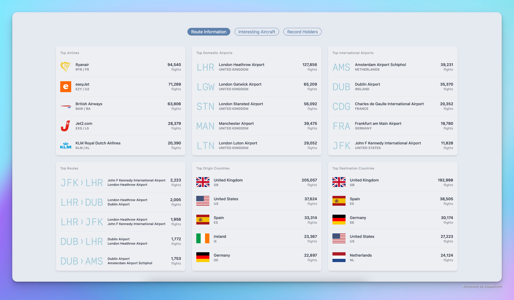
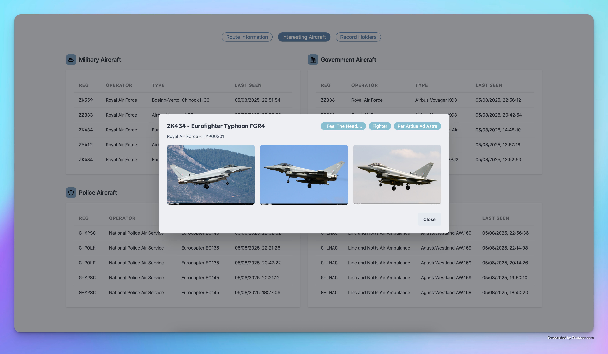

<div align="center">
    
</div>
</br>
<div align="center">
    SkyStats is an application to retrieve, store, and display interesting aircraft ADS-B data received via an SDR.
    </br></br>
    ⚠️ SkyStats is still in early developeent and considered "beta" so expect bugs and instability.
</div>
</br>


## Overview

* [Go](https://go.dev/) app with [PostgreSQL](https://www.postgresql.org/) database and [Svelte](https://svelte.dev/) + [DaisyUI](https://daisyui.com/) front end
* ADS-B data is received via [adsb-ultrafeeder](https://github.com/sdr-enthusiasts/docker-adsb-ultrafeeder) / [readsb](https://github.com/wiedehopf/readsb), running on a Raspberry Pi 4 attached to an SDR + aerial ([see it here!](docs/setup/aerial.jpg))
* The application consumes aircraft data from the readsb [aircraft.json](https://github.com/wiedehopf/readsb-githist/blob/dev/README-json.md) file
* A [gin](https://gin-gonic.com/) API surfaces information from the postgres database to the web frontend
* Registration & routing data is retrieved from the [adsb-db](https://github.com/mrjackwills/adsbdb) API
* "Interesting" aircraft are identified via a local copy of the [plane-alert-db](https://github.com/sdr-enthusiasts/plane-alert-db)

## Features
* "Above Me" - live view of 5 nearest aircraft with routing information
* Total aircraft seen (past hour, day, all time)
* Total aircraft with route data
* Unique Countries
* Unique Airports
* Top Airlines
* Top Airports (Domestic, International)
* Top Countries (Origin, Destination)
* Top Routes
* Interesting Aircraft (Miiltary, Government, Police, Civilian)
* Fastest Aircraft
* Slowest Aircraft
* Highest Aircraft
* Lowest Aircraft

## Setup

### Running in Docker (recommended)

Using SkyStats in Docker is the easiest way to get up and running.

* Copy the contents of [`.env.example`](.env.example) into a new file called `.env`
* Populate `.env` with all required values. See [Environment Variables](#environment-variables)
* Download [`example.compose.yml`](example.compose.yml) and name it compose.yml
* Run `docker compose up -d`
* The interface should be available on `localhost:5173` where localhost is the IP of the docker host

Alternatively there are some [Advanced Setup](#advanced-setup) options.
</br>

### Environment Variables

| Environment Variable | Description | Example |
|---|---|---|
| READSB_AIRCRAFT_JSON | URL of where readsb [aircraft.json](https://github.com/wiedehopf/readsb-githist/blob/dev/README-json.md) is being served e.g. http://yourhost:yourport/data/aircraft.json | `http://192.168.1.100:8080/data/aircraft.json` |
| DB_HOST | Postgres host. If running in docker this should be the name of the postgres container. If running locally it should be the IP/hostname of wherever postgres is hosted. | Docker: `skystats-db` <br/> Local: `192.168.1.10` |
| DB_PORT | Postgres port | `5432` |
| DB_USER | Postgres username | `user` |
| DB_PASSWORD | Postgres password | `1234` |
| DB_NAME | Postgres database name | `skystats_db` |
| DOMESTIC_COUNTRY_ISO | ISO 2-letter country code of the country your receiver is in - used to generate the "Domestic Airport" stats. | `GB` |
| LAT | Lattitude of your receiver. | `XX.XXXXXX` |
| LON | Longitude of your receiver. | `YY.YYYYYY` |
| RADIUS | Distance in km from your receiver that you want to record aircraft. Set to a distance greater than that of your receiver to capture all aircraft. | `1000` |
| ABOVE_RADIUS | Radius for the "Above Timeline" <br/> **Note: currently only 20km supported.** | `20` |

<br/>

## Support / Feeback

SkyStats is still under early active development. If you're having issues getting it running, or have suggestions/feedback, then the best place to get support is on the [#skystats](https://discord.gg/znkBr2eyev) channel in the [SDR Enthusiasts Discord](https://discord.gg/86Tyxjcd94). Alternatively you can raise an [Issue](https://github.com/tomcarman/skystats/issues) in GitHub, and I'll do my best to support.
</br>


## Advanced Setup

The intention is for SkyStats to be run via the [provided Docker containers](#setup). However, if you want to run locally or if you want to contribute by developing, see below guidance.

### Running locally

* BYO postgres database (in a Docker container or other)
* Copy the contents of [`.env.example`](.env.example) into a new file called `.env`
* Populate `.env` with all required values. See [Environment Variables](#environment-variables)
* Download the latest [release binary](https://github.com/tomcarman/skystats/releases) for your OS/arch
* Execute e.g. `./skystats`
* TODO: Instructions to run the webserver


### Compile from source (e.g. to develop)
* BYO postgres database (in a Docker container or other)
* Clone this repository
* Copy the contents of `.env.example` into a new file called `.env`
* Populate `.env` with all required values. See [Environment Variables](#environment-variables)
* Change to the `core` folder e.g. `cd core`
* Compile with `go build -o skystats-daemon`
* Run the app `./skystats-daemon`
    * It can be terminated via `kill $(cat skystats/core/skystats.pid)`
* Run the webserver 
    * Change to the /web directory e.g. `cd ../web`
    * Start the webserver with `npm run dev -- --host`
* See [`build`](/scripts/build) for a script to automate some of this

## Advanced Use Cases

### Custom plane-alert-db csv

If you live in an area where you frequently see planes that you are not interested in, you can provide a custom version of [plane-alert-db](https://github.com/sdr-enthusiasts/plane-alert-db).

This expects a file identical in structure to https://github.com/sdr-enthusiasts/plane-alert-db/blob/main/plane-alert-db-images.csv

Add the following the the `.env` file:
```
PLANE_DB_URL=some/custom/location/plane-alert-db.csv
```

And the following to `docker-compose.yml` under the `skystats-db-init` service:
```
- PLANE_DB_URL=${PLANE_DB_URL}
```

**⚠️ The format of the csv must match the format of combined plane data + image file from plane-alert-db**

<br/>

## Screenshots

### Home

</br>

</br>

### Route Stats

</br>

### Interesting Aircraft

</br>

</br>

### Motion Stats

